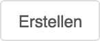
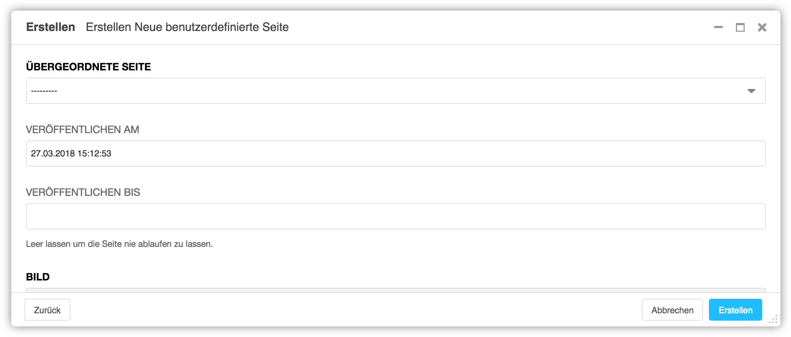

<a name="5-1-neue-benutzerdefinierte-seite">5.1 Neue benutzerdefinierte Seite</a>
-------
Eine neue benutzerdefinierte Seite kann mit dem [Assistent](../grundlagen.md#1-4-assistent) wie folgt erstellt werden:

  1. In der [django CMS Toolbar](../grundlagen.md#1-1-django-cms-toolbar) auf Erstellen klicken.
      
      
   
  2. Neue benutzerdefinierte Seite auswählen.
      
      
   
  3. Im Feld Übergeordnete Seite die Seite auswählen, welcher die neue Seite untergeordnet werden soll.
      
      
   
  4. Im Feld **Veröffentlichen am** kann festgelegt werden, wann die Seite veröffentlicht werden soll (z.B. 27.03.2018 15:12:52). Ist das Feld leer, wird die Webseite sofort veröffentlicht.
  5. Im Feld **Veröffentlichen bis** kann festgelegt werden, bis wann die Seite veröffentlicht werden soll (z.B. 27.03.2018 15:12:52). Ist das Feld leer, wird die Seite nicht automatisch deaktiviert.
  6. Unter **Bild** mit einem Klick auf **Datei auswählen** die **Medienbibliothek** öffnen und das gewünschte Bild aufrufen.
      
      
   
  7. Mit einem Klick auf **Diese Datei auswählen** das Bild der neuen Seite zuordnen.
      
      
   
  8. In den Feldern **Schlagwort, Titel, Einleitung** und **Inhalt** die entsprechenden Inhalte eintragen.
  9. Mit **Erstellen** wird die Webseite angelegt.
      
      
