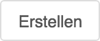
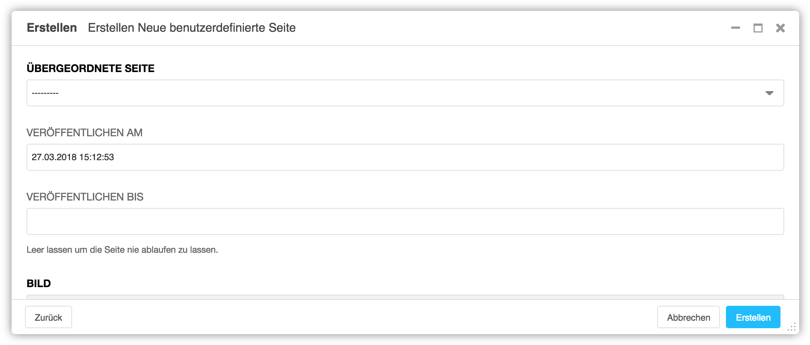
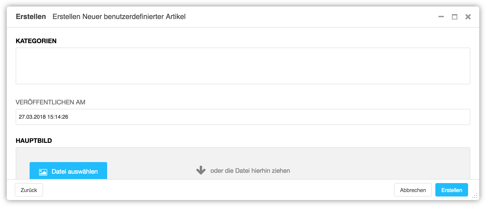

<a name="5-2-neuer-benutzerdefinierter-artikel">5.2 Neuer benutzerdefinierter Artikel</a>
-----
Ein neuer benutzerdefinierter Artikel kann mit dem [Assistent](../grundlagen.md#1-4-assistent) wie folgt erstellt werden:

  1. In der [django CMS Toolbar](../grundlagen.md#1-1-django-cms-toolbar) auf **Erstellen** klicken.
      
      
   
  2. **Neuer benutzerdefinierter Artikel** auswählen.
      
      
   
  3. Im Auswahlfeld **Kategorie** die Art des Artikels auswählen.
      
      
   
  4. Im Feld **Veröffentlichen am** kann festgelegt werden, wann der Artikel veröffentlicht werden soll (z.B. 27.03.2018 15:12:52). Ist das Feld leer, wird der Artikel sofort veröffentlicht.
  5. Unter **Hauptbild** mit einem Klick auf **Datei auswählen** die **Medienbibliothek** öffnen und das gewünschte Bild aufrufen.
      
      
   
  6. Mit einem Klick auf **Diese Datei auswählen** das Bild dem neuen Artikel zuordnen.

      
   
  7. In den Feldern **Schlagwort, Titel, Einleitung** und **Inhalt** die entsprechenden Inhalte eintragen.
  8. Mit **Erstellen** wird die Webseite angelegt.
  
      
