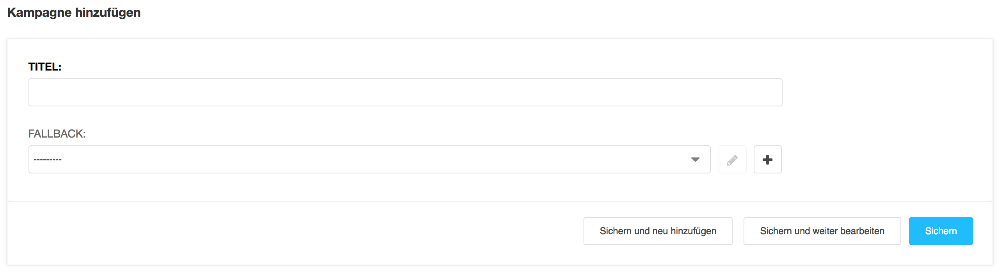
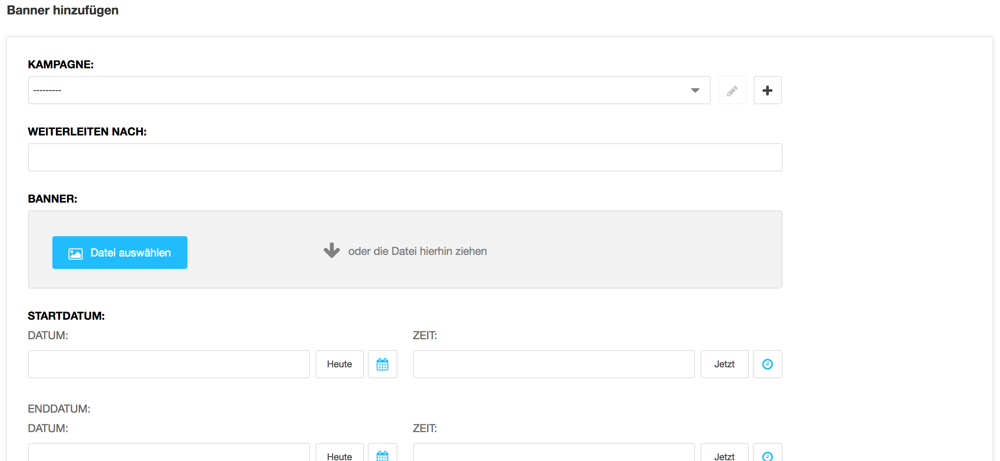

<a name="10-email-banner">10 E-Mail Banner</a>
==========
<a name="10-1-kampagne-erstellen">10.1 Kampagne erstellen</a>
-----------
Eine neue Kampagne sollte nur dann erstellen werden, wenn eine E-Mail-Signatur gleichzeitig mit unterschiedlichen Bannern beliefert werden soll (z.B. ein Banner pro Abteilung). Ist dies nicht der Fall, sollte die Standard Kampagne verwendet werden. Eine neue E-Mail-Signatur Kampagne kann wie folgt erstellt werden:

  1. In der [django CMS Toolbar](./grundlagen.md#1-1-django-cms-toolbar) unter **Radio Bern1** oder **Radio Zürisee** auf **Administration** klicken.
  2. Unter **Aldryn Email Signatures** auf **Kampagnen** und **Kampagne hinzufügen** oder eine bestehende Kampagne klicken.
      
      
  
  3. Im Feld **Titel** einen Titel für die Kampagne eintragen.
    
      
  
  4. Für den Fall das kein aktiver Banner zur Verfügung steht, kann der Kampagne unter **Fallback** ein Standard Banner zugewiesen werden.
  5. Kampagne mit **Sichern** speichern.
      
      
  
  6. In der Kampagnen Übersicht auf **HTML Code anzeigen** klicken und den HTML-Code kopieren.
      
      
  
  7. Der HTML Code muss von der Technik manuell in die Signatur der Mitarbeiter eingefügt werden. Hierzu muss ein [Support Ticket](./support-ticket.md#2-support-ticket) eröffnet werden.

<a name="10-2-banner-erstellen">10.2 Banner erstellen</a>
------------
Es können mehrere E-Mail-Banner einer Kampagne zugeordnet werden. Die Laufzeit von E-Mail- Bannern darf sich nicht überschneiden. Ein neuer E-Mail-Banner kann wie folgt erstellt werden:

  1. In der [django CMS Toolbar](./grundlagen.md#1-1-django-cms-toolbar) unter **Radio Bern1** oder **Radio Zürisee** auf Administration klicken.
  2. Unter **Aldryn Email Signatures** auf **Banners** und **Banner hinzufügen** oder einen bestehenden Banner klicken.
    
      
  
  3. Im Feld **Kampagne** die gewünschte Standard Kampagne **Radio Bern1** oder **Radio Zürisee** auswählen oder eine neue Kampagne erstellen.
      
      
  
  4. Im Feld **Weiterleiten nach** die Adresse für die Weiterleitung eintragen (z.B. https://www.radio.ch/).
  5. Unter Banner mit einem Klick auf **Datei auswählen** ein Bild aus der **Medienbibliothek** auswählen.
  6. Im Feld **Startdatum** muss festgelegt werden, wann der Banner angezeigt werden soll (z.B. 27.03.2018 15:12:52).
  7. Im Feld **Enddatum** kann festgelegt werden, bis wann der Banner angezeigt werden soll (z.B. 27.03.2018 15:12:52). Ist das Feld leer, wird der Banner nicht automatisch deaktiviert.
  8. Banner mit Sichern speichern.
      
      
