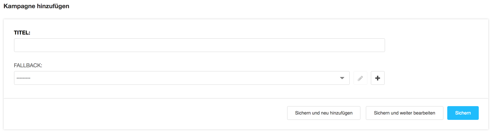
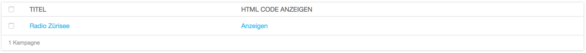

<a name="10-1-kampagne-erstellen">10.1 Kampagne erstellen</a>
-----------
Eine neue Kampagne sollte nur dann erstellen werden, wenn eine E-Mail-Signatur gleichzeitig mit unterschiedlichen Bannern beliefert werden soll (z.B. ein Banner pro Abteilung). Ist dies nicht der Fall, sollte die Standard Kampagne verwendet werden. Eine neue E-Mail-Signatur Kampagne kann wie folgt erstellt werden:

  1. In der [django CMS Toolbar](../grundlagen.md#1-1-django-cms-toolbar) unter **Radio Bern1** oder **Radio Zürisee** auf **Administration** klicken.
  2. Unter **Aldryn Email Signatures** auf **Kampagnen** und **Kampagne hinzufügen** oder eine bestehende Kampagne klicken.
      
      
  
  3. Im Feld **Titel** einen Titel für die Kampagne eintragen.
    
      
  
  4. Für den Fall das kein aktiver Banner zur Verfügung steht, kann der Kampagne unter **Fallback** ein Standard Banner zugewiesen werden.
  5. Kampagne mit **Sichern** speichern.
      
      
  
  6. In der Kampagnen Übersicht auf **HTML Code anzeigen** klicken und den HTML-Code kopieren.
      
      
  
  7. Der HTML Code muss von der Technik manuell in die Signatur der Mitarbeiter eingefügt werden. Hierzu muss ein [Support Ticket](../support-ticket.md#2-support-ticket) eröffnet werden.
