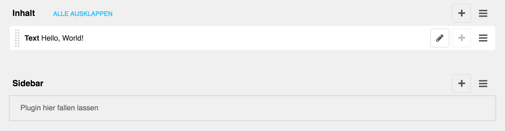

<a name="1-grundlagen">1 Grundlagen</a>
=========

<a name="1-1-django-cms-toolbar">1.1 django CMS Toolbar</a>
-------

Im django CMS findet die komplette Verwaltung der Webseite über die sogenannte django CMS Toolbar statt. Im django CMS gibt es keine, wie bei anderen CMS-Systemen üblich, separate Verwaltung der Webseiten. Die Verwaltung findet auf der Webseite direkt statt.
Die django CMS Toolbar ist unterhalb der Adresszeile des Browsers angesiedelt und kann mit dem kleinen Dreieck ein- und ausgeblendet werden.

 

<a name="1-2-medienbibliothek">1.2 Medienbibliothek</a>
-------

Die Medienbibliothek ist der zentrale Dateispeicher der Webseite. In der Medienbibliothek können Ordner erstellt, Dateien hochgeladen und verschoben werden. Wird eine Datei oder ein Ordner verschoben oder umbenannt, muss eine allfällig bestehende Verlinkung auf der Webseite nicht angepasst werden. Die Verlinkung einer in der Medienbibliothek abgelegt Datei funktioniert unabhängig vom Speicherort der Datei.

Da die Webseite Bilder automatisch verkleinert und zuschneidet sollten die Bilder immer in möglichst hoher Auflösung hochgeladen werden.

Die maximalle Dateigrösse beträgt 100 Megabyte.

<a name="1-3-focal-point">1.3 Focal Point</a>
----
Mit dem Focal Point wird der Bildschwerpunkt markiert. Bilder werden im django CMS automatisch verkleinert und zugeschnitten. Der Focal Point soll gewährleisten, dass während dieses Vorgangs der Bildschwerpunkt möglichst immer im Zentrum dargestellt und nicht versehentlich abgeschnitten wird. Der Focal Point liegt standardmässigen in der vertikalen und horizontalen Mitte des Bildes.

<a name="1-4-assistent">1.4 Assistent</a>
----
Ein Assistent fasst die einzelnen Schritte die zur Erstellung einer Webseite notwendig sind in einem Formular zusammen. Die Erstellung von Webseiten und Artikeln wird dadurch deutlich vereinfacht und ist auch für Benutzer ohne Administratorenrechte zugänglich.

<a name="1-5-seitenbaum">1.5 Seitenbaum</a>
----
Der Seitenbaum ist die zentrale Verwaltung für Seiten. Seiten werden im Seitenbaum hierarchisch in einer Baumstruktur dargestellt. Im Seitenbaum können Seiten unter anderem erstellt, sortiert, versteckt und gelöscht werden.

Die Reihenfolge, Zuordnung und Sichtbarkeit der Seiten wird dabei im Menü der Webseite übernommen.

<a name="1-6-slug">1.6 Slug</a>
----
Beim Slug handelt es sich um eine URL-freundliche Kurzform des Titels die zur Bildung der Adresse der Seite verwendet wird. Der Slug einer Unterseite wird stets an den Slug einer übergeordneten Seite angehängt und spiegelt somit die Hierarchie einer Webseite wieder.
Der Slug sollte stets sorgfältig gewählt werden, da dieser die Lesbarkeit verbessert und zur Suchmaschinenoptimierung beiträgt. Der Slug sollte möglichst auch nicht geändert werden, da dadurch allenfalls bestehende Verlinkungen auf die Webseite nicht länger funktionieren (z.B. via soziale Netzwerke).

<a name="1-7-schlagwort">1.7 Schlagwort</a>
----
Das Schlagwort ist ein Wort, das der inhaltlichen Erschliessung dient. Das Schlagwort fasst den Inhalt einer Seite in einem besonders einprägsamen Wort zusammen. Das Schlagwort kann auch aus mehreren Wörtern bestehen, sollte aber so kurz wie möglich gehalten werden. Das Schlagwort wird unter anderem im Teaser dargestellt.

<a name="1-8-meta-informationen">1.8 Meta-Informationen</a>
----
Mithilfe der Meta-Informationen werden Suchmaschinen und Social Media Plattformen Informationen zum Inhalt einer Webseite vermittelt. Meta-Informationen können Informationen wie z.B. zum Inhalt, Herausgeber, Autor und Copyright enthalten. Als Titel wird der Titel der Webseite verwendet. Diese Informationen werden dann im Suchresultat einer Suchmaschine oder bei geteilten Links auf Facebook dargestellt.

<a name="1-9-inhalte">1.9 Inhalte</a>
----
Im django CMS werden die einzelnen Inhalte einer Webseite durch sogenannte Plugins hinzugefügt. So gibt es unter anderem Plugins um Bilder, Videos oder Text hinzuzufügen. Plugins können innerhalb einer Webseite nicht frei platziert werden, sondern müssen an vorbestimmten Plätzen eingefügt werden. Die vorbestimmten Plätze sind über den Strukturmodus ersichtlich. Die Plätze Inhalt und Sidebar stehen dabei fast immer zur Verfügung.

Die Reihenfolge der Darstellung der Plugins kann über die Drag and Drop-Funktion (Ziehen und Ablegen) verändert werden. Bei diversen Plugins ist es zudem möglich, untergeordnete Plugins hinzuzufügen. So muss zum Beispiel beim Karussell Plugin ein übergeordnetes Plugin für das Karussell (z.B. zur Einstellung von Stil und Übergangeffekt) und ein untergeordnetes Plugin für jeden einzelnen Karussell Eintrag (z.B. für Bild und Bildbeschriftung) erstellt werden. Auch untergeordnete Plugins können mit der Drag and Drop-Funktion (Ziehen und Ablegen) sortiert werden.

Wird eine neue Unterseite erstellt oder werden Änderungen auf einer Seite vorgenommen, sind diese vorerst nur für den angemeldeten Benutzer ersichtlich. Dadurch können Seiten in Ruhe vorbereitet werden, bevor diese mit einer Veröffentlichung für die Öffentlichkeit zugänglich gemacht werden. Jede Änderung an der Webseite bedarf einer erneuten Veröffentlichung. Eine Webseite besteht dadurch immer aus einem Entwurf und einer für die Öffentlichkeit zugänglichen Version.

<a name="1-10-bildquellen">1.10 Bildquellen</a>
----
Bilder für Webseiten können bei den Bilddatenbanken wie <a href="http://stock.adobe.com/" target="_blank">Adobe Stock</a> und <a href="http://pixabay.com/" target="_blank">Pixabay</a> heruntergeladen werden (Bildnachweis nicht erforderlich). Weitere Bilder können von der <a href="http://db.pr.keystone-sda.ch/" target="_blank">PPR Datenbank</a> oder vom <a href="http://presseportal.ch/" target="_blank">Presseportal</a> bezogen werden (Bildnachweis zwingend erforderlich). Zusätzlich können eigene Fotos, Pressebilder sowie Bildzitate (z.B. Bildschirmfotos von Videos) für die Erstellung von Web-Inhalte verwendet werden (Bildnachweis zwingend erforderlich).
Aus Urheberrechtsgründen bitte keine Bilder von Suchmaschinen oder anderen Webseiten verwenden.
