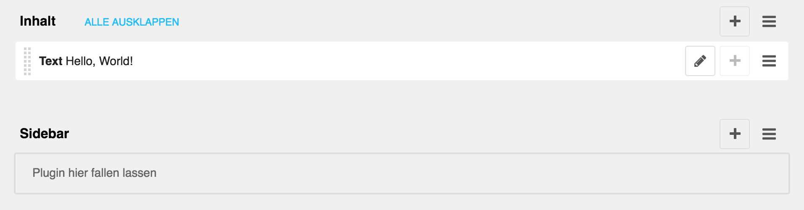
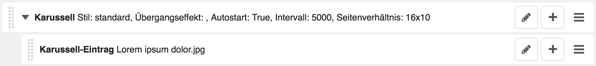

<a name="1-9-inhalte">1.9 Inhalte</a>
----
Im django CMS werden die einzelnen Inhalte einer Webseite durch sogenannte Plugins hinzugefügt. So gibt es unter anderem Plugins um Bilder, Videos oder Text hinzuzufügen. Plugins können innerhalb einer Webseite nicht frei platziert werden, sondern müssen an vorbestimmten Plätzen eingefügt werden. Die vorbestimmten Plätze sind über den Strukturmodus ersichtlich. Die Plätze Inhalt und Sidebar stehen dabei fast immer zur Verfügung.

Die Reihenfolge der Darstellung der Plugins kann über die Drag and Drop-Funktion (Ziehen und Ablegen) verändert werden. Bei diversen Plugins ist es zudem möglich, untergeordnete Plugins hinzuzufügen. So muss zum Beispiel beim Karussell Plugin ein übergeordnetes Plugin für das Karussell (z.B. zur Einstellung von Stil und Übergangeffekt) und ein untergeordnetes Plugin für jeden einzelnen Karussell Eintrag (z.B. für Bild und Bildbeschriftung) erstellt werden. Auch untergeordnete Plugins können mit der Drag and Drop-Funktion (Ziehen und Ablegen) sortiert werden.

Wird eine neue Unterseite erstellt oder werden Änderungen auf einer Seite vorgenommen, sind diese vorerst nur für den angemeldeten Benutzer ersichtlich. Dadurch können Seiten in Ruhe vorbereitet werden, bevor diese mit einer Veröffentlichung für die Öffentlichkeit zugänglich gemacht werden. Jede Änderung an der Webseite bedarf einer erneuten Veröffentlichung. Eine Webseite besteht dadurch immer aus einem Entwurf und einer für die Öffentlichkeit zugänglichen Version.

