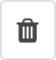

<a name="4-medienbibliothek">4 Medienbibliothek</a>
=====
In der [Medienbibliothek](../grundlagen.md#1-2-medienbibliothek) können Ordner erstellt, Dateien hochgeladen und verschoben werden: 

<a name="4-1-neuer-ordner">4.1 Neuer Ordner</a>
------
Ein neuer Ordner kann wie folgt erstellt werden:

  1. In der [django CMS Toolbar](../grundlagen.md#1-1-django-cms-toolbar) unter **Radio Bern1** oder **Radio Zürisee** auf **Medienbibliothek** klicken.
  2. Innerhalb der **Medienbibliothek** zu der Position navigieren an welcher der neue Ordner angelegt werden soll.
  3. Auf **Neuer Ordner** klicken und den **Name** eintragen.
      
      
      
  4. Mit einem Klick auf **Sichern** wird der Ordner angelegt.

<a name="4-2-dateien-hochladen">4.2 Dateien hochladen</a>
----
Mediendateien (z.B. MP3-Dateien, Videos und Bilder) können wie folgt hochgeladen werden:

  1. In der [django CMS Toolbar](../grundlagen.md#1-1-django-cms-toolbar) unter **Radio Bern1** oder **Radio Zürisee** auf **Medienbibliothek** klicken.
  2. Innerhalb der **Medienbibliothek** zu der Position navigieren an welcher die Datei abgelegt werden soll.
  3. Auf **Dateien hochladen** klicken oder die Datei mit der Drag and Drop-Funktion (Ziehen und Ablegen) in den Zielordner ziehen. Es können mehrere Dateien gleichzeigt hochgeladen werden.
    
      
        
  4. Die gewünschte Datei auf dem Computer markieren und mit **Öffnen** hochladen.         

<a name="4-3-verschieben">4.3 Verschieben</a>
----
Dateien und Ordner können wie folgt an eine andere Position verschoben werden:

  1. In der [django CMS Toolbar](../grundlagen.md#1-1-django-cms-toolbar) unter **Radio Bern1** oder **Radio Zürisee** auf **Medienbibliothek** klicken.
  2. Innerhalb der **Medienbibliothek** die gewünschten Dateien oder den gewünschten Ordner mit einem Häkchen markieren.
    
      
      
  3. Auf das **Verschieben** Symbol klicken.
      
      
      
  4. Unter **Zielordner** den gewünschten Zielordner auswählen und mit **Verschieben** bestätigen.
      
      

<a name="4-4-loeschen">4.4 Löschen</a>
----
Dateien und Ordner können wie folgt gelöscht werden:

  1. In der [django CMS Toolbar](../grundlagen.md#1-1-django-cms-toolbar) unter **Radio Bern1** oder **Radio Zürisee** auf **Medienbibliothek** klicken.
  2. Die zu löschende Datei oder den zu löschenden Ordner in der **Medienbibliothek** aufrufen und auf **Löschen** klicken.
    
      
      
  3. Mit einem Klick auf die Schaltfläche **Ja, ich bin sicher** werden die ausgewählten Dateien oder Ordner und die damit verbundene Plugins unwiderruflich gelöscht.

<a name="4-5-focal-point">4.5 Focal Point</a>
----
Ein benutzerdefinierter [Focal Point](../grundlagen.md#1-3-focal-point) kann wie folgt festgelegt werden:

  1. In der [django CMS Toolbar](../grundlagen.md#1-1-django-cms-toolbar) unter **Radio Bern1** oder **Radio Zürisee** auf **Medienbibliothek** klicken.
  2. Das gewünschte Bild in der **Medienbibliothek** aufrufen und auf **Ändern** klicken.
    
      
      
  3. Unter **Bild ändern** die rote Markierung an die Position bewegen, auf welcher der Bildschwerpunkt liegt.
    
      
      
  4. Den neue Focal Point mit **Sichern** speichern.
      
      
