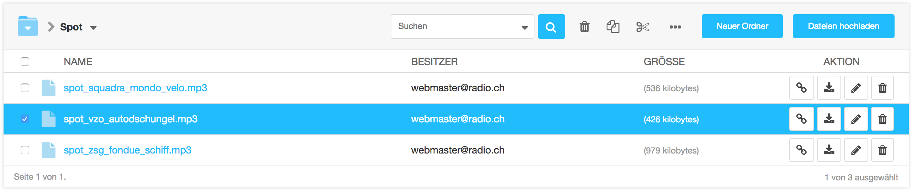

<a name="4-3-verschieben">4.3 Verschieben</a>
----
Dateien und Ordner können wie folgt an eine andere Position verschoben werden:

  1. In der [django CMS Toolbar](../grundlagen.md#1-1-django-cms-toolbar) unter **Radio Bern1** oder **Radio Zürisee** auf **Medienbibliothek** klicken.
  2. Innerhalb der **Medienbibliothek** die gewünschten Dateien oder den gewünschten Ordner mit einem Häkchen markieren.
    
      
      
  3. Auf das **Verschieben** Symbol klicken.
      
      
      
  4. Unter **Zielordner** den gewünschten Zielordner auswählen und mit **Verschieben** bestätigen.
      
      
