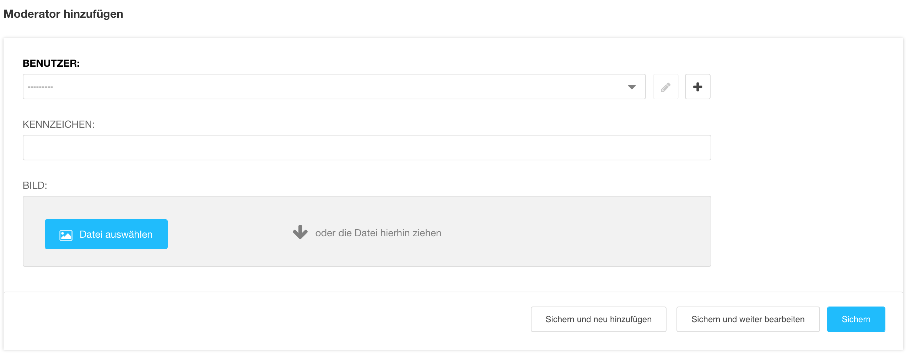

<a name="11-moderator">11 Moderator</a>
======
<a name="11-1-moderator-hinzufügen">11.1 Moderator hinzufügen</a>
--------
Ein neuer Moderator kann wie folgt hinzugefügt werden:

  1. In der [django CMS Toolbar](./grundlagen.md#1-1-django-cms-toolbar) unter **Radio Bern1** oder **Radio Zürisee** auf **Administration** klicken.
  2. Unter **Aldryn Radio Hosts** auf **Moderatoren** und **Moderator** hinzufügen oder einen bestehenden Moderator klicken.
    
      
      
  3. Im Feld **Benutzer** einen zuvor registrieren Benutzern auswählen.
  4. Für die Anzeige auf der Webseite muss die Dabis Abkürzung des Moderators im Feld **Kennzeichen** hinterlegt werden.
    
      
      
  5. Im Feld **Bild** das Bild auswählen, welches auf der Webseite angezeigt werden soll.
  6. Neuen Moderator mit **Sichern** speichern.
      
      
