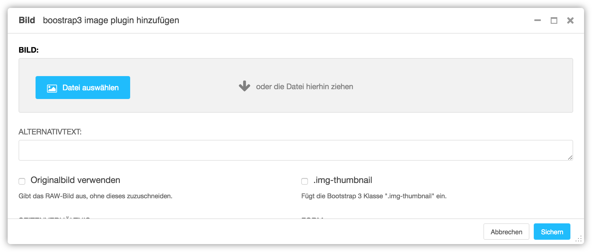
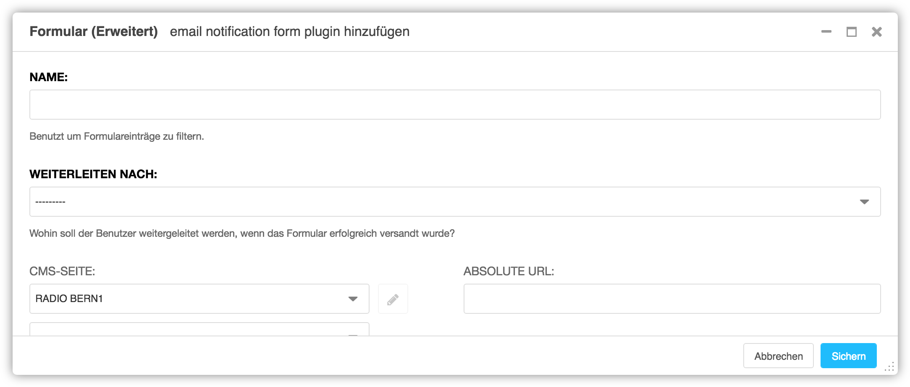
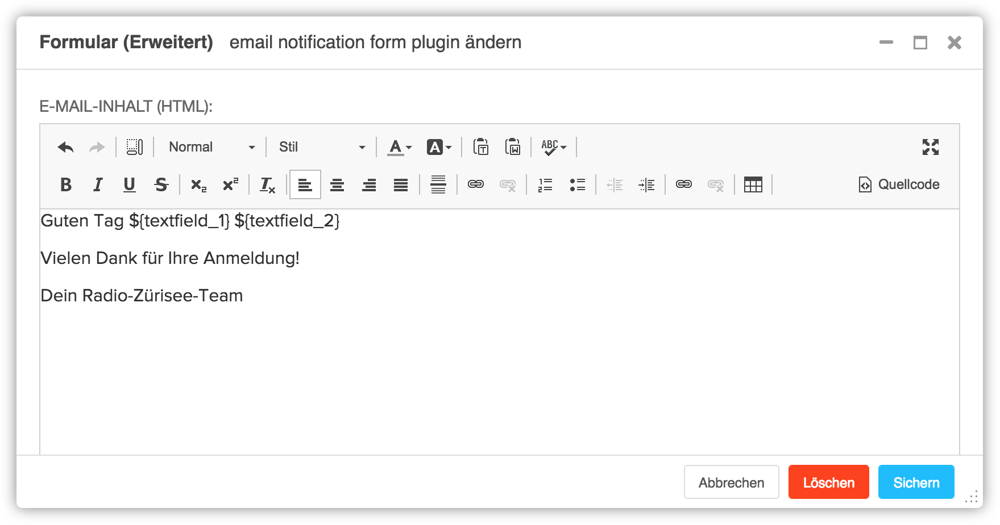
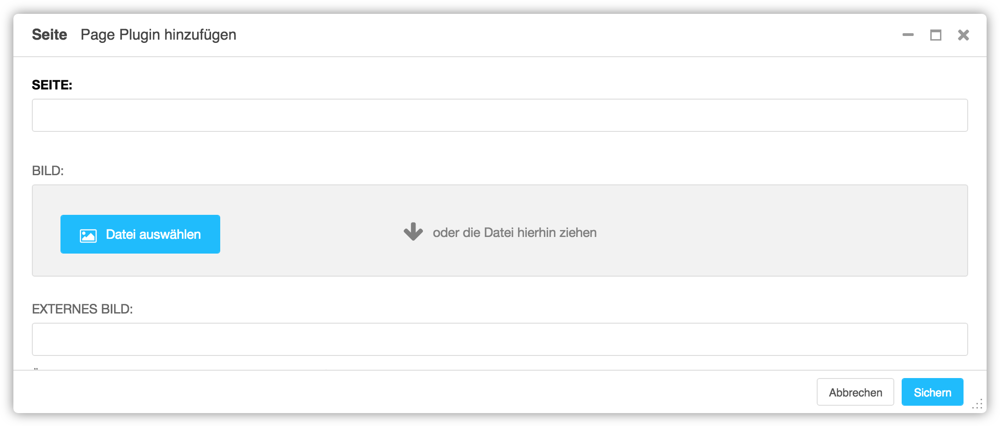
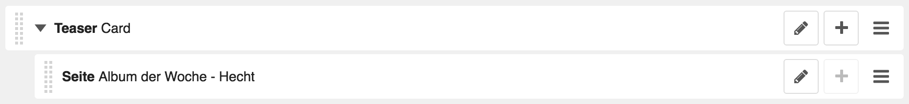
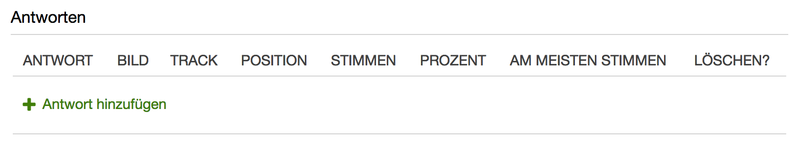
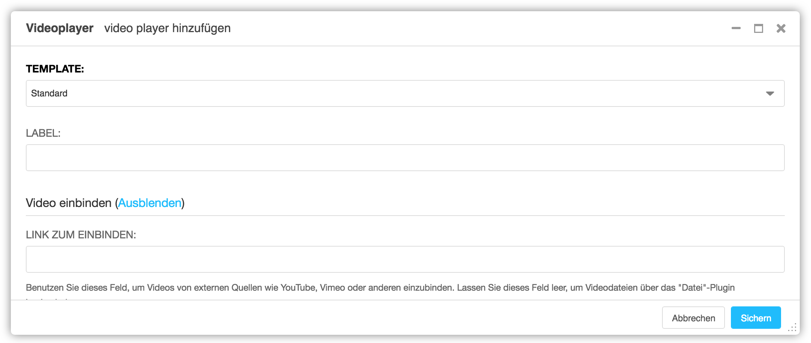

<a name="7-plugins">7 Plugins</a>
========
<a name="7-1-text">7.1 Text</a>
--------
Ein Text kann wie folgt hinzugefügt werden:

  1. Unter **Plugin zu Inhalt hinzufügen** nach **Text** suchen.
    
      
      
  2. In der freien Fläche den Text eintragen und wie gewünscht formatieren.
    
      
    
  3. Text Plugin mit **Sichern** speichern.
    
      
    
Beim Text Plugin ist es nicht nötig pro Absatz ein Plugin einzufügen. Texte können innerhalb eines Text Plugins beliebig formatiert werden.

<a name="7-2-bild">7.2 Bild</a>
-----
Ein Bild kann wie folgt hinzugefügt werden:

  4. Unter **Plugin zu Inhalt hinzufügen** nach **Bild** suchen.
    
      
      
  5. Unter **Bild** mit einem Klick auf **Datei auswählen** ein Bild aus der **Medienbibliothek** auswählen.
    
      
  
  6. Mit einem Klick auf **Diese Datei auswählen** die Datei dem Plugin zuordnen.
    
      
    
  7. Im Feld **Seitenverhältnis** das gewünschte Seitenverhältnis des Bildes auswählen.
  8. Unter **Erweiterte Einstellungen** kann unter **Breite überschreiben** und **Höhe überschreiben** die Grösse des Bildes überschrieben werden.
  9. Bild Plugin mit **Sichern** speichern.
    
      

<a name="7-3-formular">7.3 Formular</a>
-----
Ein Formular kann wie folgt hinzugefügt werden:

  1. Unter **Plugin zu Inhalt hinzufügen** nach **Formular (Erweitert)** suchen.
    
      
      
  2. Unter **Name** den Namen des Formulars eintragen. Der Name wird auch im Betreff der E-Mail verwenden.
    
      
      
  3. Unter **Weiterleiten nach** kann festgelegt werden, wohin der Benutzer nach dem Versenden des Formulars weitergeleitet wird (z.B. Dankes-Seite).
  4. Um E-Mail-Inhalt und die Empfänger zu definieren, im Auswahlfeld **Vorlage** den Wert **Standard** auswählen. Danach muss das Plugin einmal mit **Sichern** gespeichert werden.
    
      

  5. Das zuvor gespeicherte Plugin mit **Editieren** erneut öffnen.
    
      

  6. Unter **Vorlage** und **Empfänger** können nun **E-Mail des Absenders** und **E-Mail des Empfängers** für das Formular hinterlegt werden. Dabei können unter **Felder** auch Felder aus dem Kontaktformular verwendet werden.
    
      
      
  7. Unter **Vorlage** und **E-Mail-Adresse** können **Betreff** und **E-Mail-Inhalt** als Text und HTML gespeichert werden. Auch hier können Felder aus dem Kontaktformular verwendet werden.
    
      
      
  8. Übergeordnetes Formular (Erweitert) Plugin mit **Sichern** speichern.
    
      

  9. Mit **Plugin hinzufügen** pro Formular-Feld und für den Sende-Button ein untergeordnetes Plugin einfügen. Dabei können **Label, Platzhaltertext, Hilfetext, Mindestlänge, Maximale Länge** und die **Fehlermeldung** pro Feld definiert werden. Das Feld **Name** leer lassen. Mit **Feld ist zwingend erforderlich** kann festgelegt werden, ob ein Feld vom Benutzer ausgefüllt werden muss.
    
      
      
  10. Feld Plugin mit **Sichern** speichern und Ablauf pro Feld wiederholen.
    
      

<a name="7-4-podcast-player">7.4 Podcast Player</a>
-------
Eine Podcast Player kann wie folgt hinzugefügt werden:

  1. Unter **Plugin zu Inhalt hinzufügen** nach **PodcastPlayer** suchen.
      
      

  2. Unter **Titel** den Titel des Podcast Players eintragen.
    
      

  3. Gewünschte Podcasts auswählen.
    a. Unter **Automatisierte Podcasts** können mit gedrückter Control-Taste Podcasts aus bereits ausgestrahlte Podcasts aus der Sendesoftware ausgewählt werden.
    b. Unter **Podcasts** können manuelle Podcasts über die [Medienbibliothek](./grundlagen.md#1-2-medienbibliothek) ausgewählt oder hochgeladen werden.
    c. Unter **Nach Podcasts suchen** können nach Podcast Titel und Typ gesucht werden. Auch zukünftige Podcasts werden dabei berücksichtigt.
  4. Im Feld **Veröffentlichen am** kann festgelegt werden, wann der Podcast Player veröffentlicht werden soll (z.B. 27.03.2018 15:12:52). Ist das Feld leer, wird der Podcast Player sofort veröffentlicht.
  5. Im Feld **Veröffentlichen bis** kann festgelegt werden, bis wann der Podcast Player veröffentlicht werden soll (z.B. 27.03.2018 15:12:52). Ist das Feld leer, wird der Podcast Player nicht automatisch deaktiviert.
  6. Podcast Plugin mit **Sichern** speichern.
    
      
    
Es ist nicht nötig pro Podcast ein Podcast Player einzufügen. Es können mehrere Podcasts innerhalb
eines Players dargestellt werden.

<a name="7-5-teaser">7.5 Teaser</a>
---------

Ein Teaser kann wie folgt hinzugefügt werden:

  1. Unter **Plugin zu Inhalt hinzufügen** nach **Teaser** suchen.
      
      

  2. Im Feld **Limit** die maximale Anzahl an untergeordneten Plugins festgelegen oder leer lassen wenn es keine Beschränkung geben soll.
      
      

  3. Im Feld **Stil** die gewünschte Darstellung der Teaser festlegen.
  4. Übergeordnetes Teaser Plugin mit **Sichern** speichern.
    
      

  5. Mit **Plugin hinzufügen** pro Teaser ein untergeordnetes Plugin einfügen.
      
      

  6. Unter **Seite** die gewünschte Zielseite auswählen.
    
      
      
  7. Bild, Schlagwort und Titel werden automatisch von der Zielseite zugeordnet, sofern diese korrekt hinterlegt sind. Alternativ können Bild, Schlagwort und Titel auch in den Feldern **Bild, Externes Bild, Schlagwort** und **Titel** überschrieben werden.
  8. Im Feld **Veröffentlichen am** kann festgelegt werden, wann der Teaser veröffentlicht werden soll (z.B. 27.03.2018 15:12:52). Ist das Feld leer, wird der Teaser sofort veröffentlicht.
  9. Im Feld **Veröffentlichen bis** kann festgelegt werden, bis wann der Teaser veröffentlicht werden soll (z.B. 27.03.2018 15:12:52). Ist das Feld leer, wird der Teaser nicht automatisch deaktiviert.
  10. Untergeordnetes Seite Plugin mit **Sichern** speichern.
    
      

  11. Das Resultat sollte wie folgt aussehen.
      
      

<a name="7-6-umfrage">7.6 Umfrage</a>
----
Eine Umfrage kann wie folgt hinzugefügt werden:

  1. Unter **Plugin zu Inhalt hinzufügen** nach **Umfrage** suchen.
      
      

  2. Unter **Umfrage** eine bestehende Umfrage auswählen, mit **Ausgewählte Umfrage ändern** eine **Umfrage bearbeiten** oder mit Umfrage hinzufügen eine neue Umfrage erstellen.
      
      

  3. Im Fenster **Umfrage hinzufügen** im Feld **Frage** einen Titel oder eine Frage eingeben.
    
      

  4. Unter **Anzahl möglicher Antworten** angeben, wie viele Stimmen pro Person abgegeben werden können.
  5. Unter **Resultat anzeigen** kann festgelegt werden, ob Teilnehmer nach der Stimmabgabe das Resultat sehen können.
  6. Im Feld **Veröffentlichen am** kann festgelegt werden, wann die Umfrage veröffentlicht werden soll (z.B. 27.03.2018 15:12:52). Ist das Feld leer, wird die Umfrage sofort veröffentlicht.
  7. Im Feld **Veröffentlichen bis** kann festgelegt werden, bis wann die Umfrage veröffentlicht werden soll (z.B. 27.03.2018 15:12:52). Ist das Feld leer, wird die Umfrage nicht automatisch deaktiviert.
      
      
  
  8. Unter **Antworten** pro gewünschte Antwort einmal auf **Antwort hinzufügen** klicken.
  9. Antwort hinzufügen.
    a. Feld **Antwort** ausfüllen um eine reine Text Umfrage zu erstellen.
    b. Felder **Antwort** und **Bild** ausfüllen um eine Umfrage mit Text und Bild zu erstellen.
    c. Im Feld **Track** nach einem Song suchen um eine Song Umfrage zu erstellen.
    d. Im Feld **Position** kann die Reihenfolge der Antworten festgelegt werden.
  10. Mit **Sichern** die neu erstellte Umfrage dem Umfrage Plugin hinzufügen.
  11. Umfrage Plugin mit **Sichern** speichern.
      
      

<a name="7-7-videoplayer">7.7 Videoplayer</a>
-----
Es können ausschliesslich YouTube Videos mit dem Videoplayer eingebunden werden. Ein YouTube Video kann wie folgt hinzugefügt werden:

  1. Unter **Plugin zu Inhalt hinzufügen** nach **Videoplayer** suchen.
      
      
    
  2. Unter **Video einbinden** auf **Einblenden** klicken und den YouTube Link unter **Link zum Einbinden** einfügen.
    
      
  3. Video mit **Sichern** speichern.
      
      
