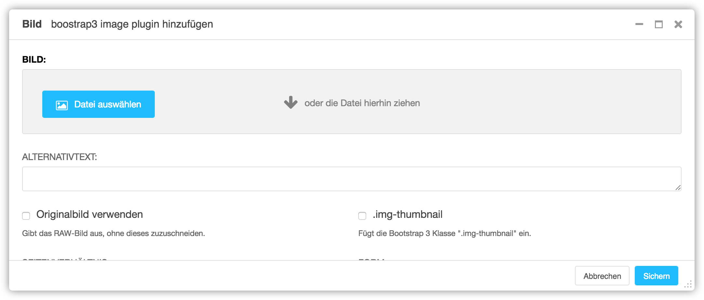

<a name="7-2-bild">7.2 Bild</a>
-----
Ein Bild kann wie folgt hinzugefügt werden:

  4. Unter **Plugin zu Inhalt hinzufügen** nach **Bild** suchen.
    
      
      
  5. Unter **Bild** mit einem Klick auf **Datei auswählen** ein Bild aus der **Medienbibliothek** auswählen.
    
      
  
  6. Mit einem Klick auf **Diese Datei auswählen** die Datei dem Plugin zuordnen.
    
      
    
  7. Im Feld **Seitenverhältnis** das gewünschte Seitenverhältnis des Bildes auswählen.
  8. Unter **Erweiterte Einstellungen** kann unter **Breite überschreiben** und **Höhe überschreiben** die Grösse des Bildes überschrieben werden.
  9. Bild Plugin mit **Sichern** speichern.
    
      
