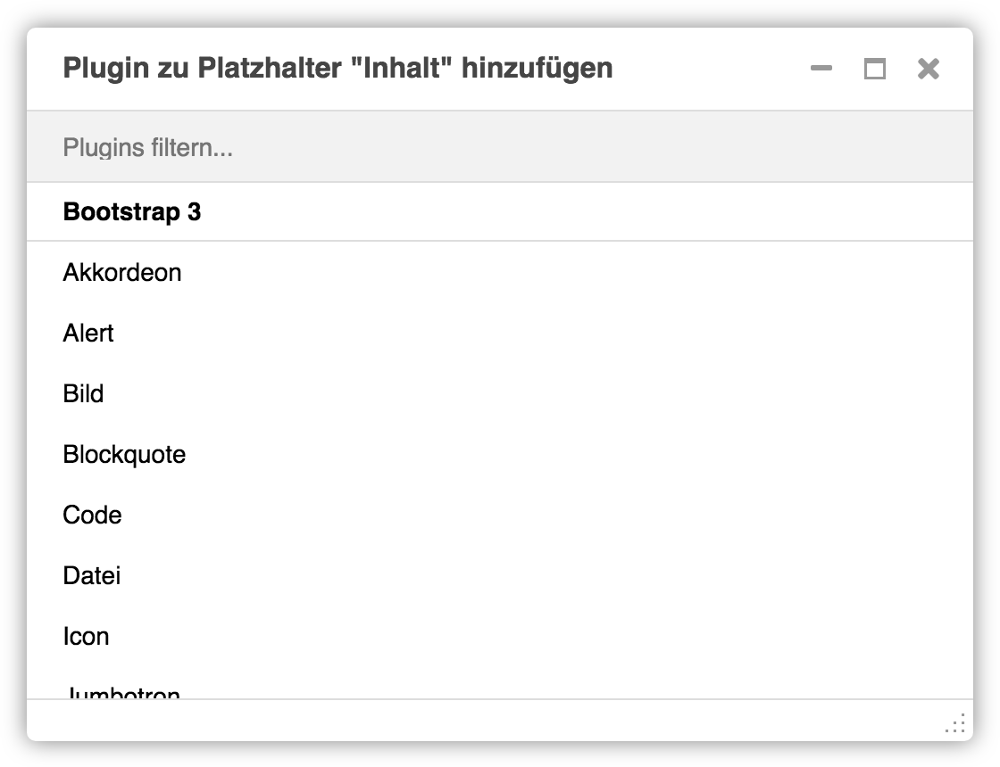
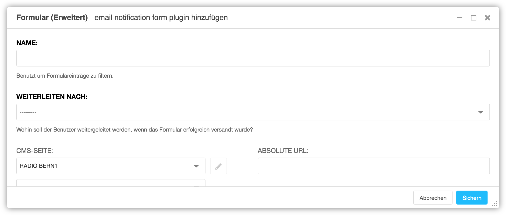
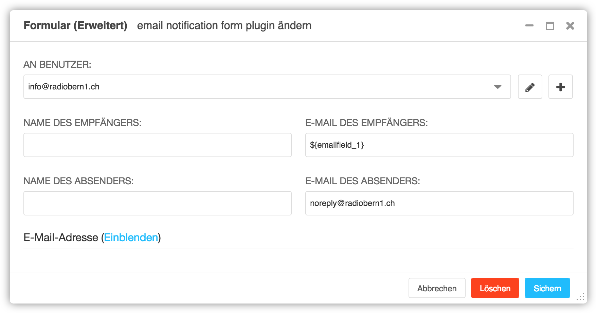
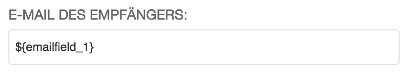
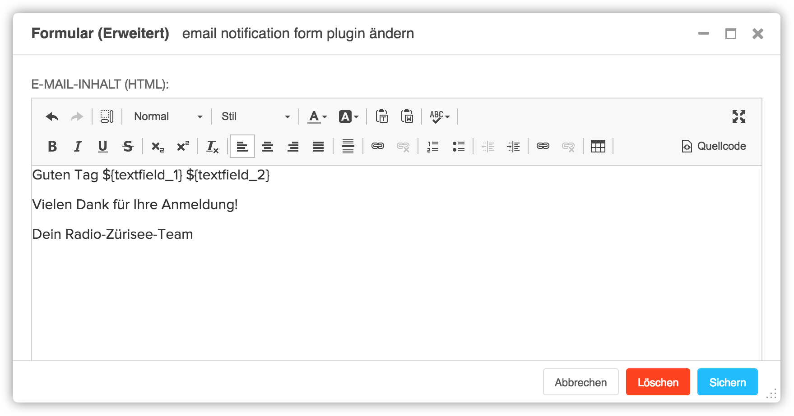
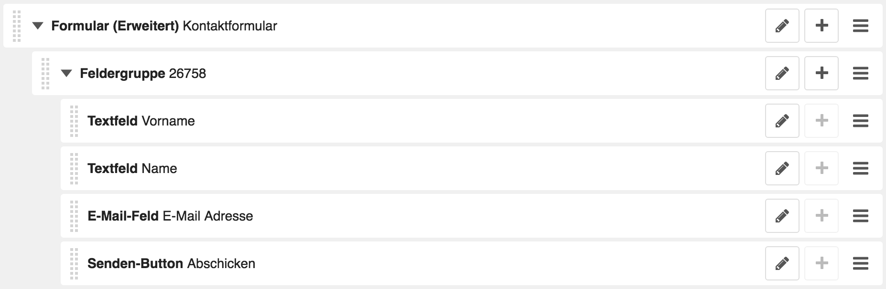

<a name="7-3-formular">7.3 Formular</a>
-----
Ein Formular kann wie folgt hinzugefügt werden:

  1. Unter **Plugin zu Inhalt hinzufügen** nach **Formular (Erweitert)** suchen.
    
      
      
  2. Unter **Name** den Namen des Formulars eintragen. Der Name wird auch im Betreff der E-Mail verwenden.
    
      
      
  3. Unter **Weiterleiten nach** kann festgelegt werden, wohin der Benutzer nach dem Versenden des Formulars weitergeleitet wird (z.B. Dankes-Seite).
  4. Um E-Mail-Inhalt und die Empfänger zu definieren, im Auswahlfeld **Vorlage** den Wert **Standard** auswählen. Danach muss das Plugin einmal mit **Sichern** gespeichert werden.
    
      

  5. Das zuvor gespeicherte Plugin mit **Editieren** erneut öffnen.
    
      

  6. Unter **Vorlage** und **Empfänger** können nun **E-Mail des Absenders** und **E-Mail des Empfängers** für das Formular hinterlegt werden. Dabei können unter **Felder** auch Felder aus dem Kontaktformular verwendet werden.
    
      
      
  7. Unter **Vorlage** und **E-Mail-Adresse** können **Betreff** und **E-Mail-Inhalt** als Text und HTML gespeichert werden. Auch hier können Felder aus dem Kontaktformular verwendet werden.
    
      
      
  8. Übergeordnetes Formular (Erweitert) Plugin mit **Sichern** speichern.
    
      

  9. Mit **Plugin hinzufügen** pro Formular-Feld und für den Sende-Button ein untergeordnetes Plugin einfügen. Dabei können **Label, Platzhaltertext, Hilfetext, Mindestlänge, Maximale Länge** und die **Fehlermeldung** pro Feld definiert werden. Das Feld **Name** leer lassen. Mit **Feld ist zwingend erforderlich** kann festgelegt werden, ob ein Feld vom Benutzer ausgefüllt werden muss.
    
      
      
  10. Feld Plugin mit **Sichern** speichern und Ablauf pro Feld wiederholen.
    
      
