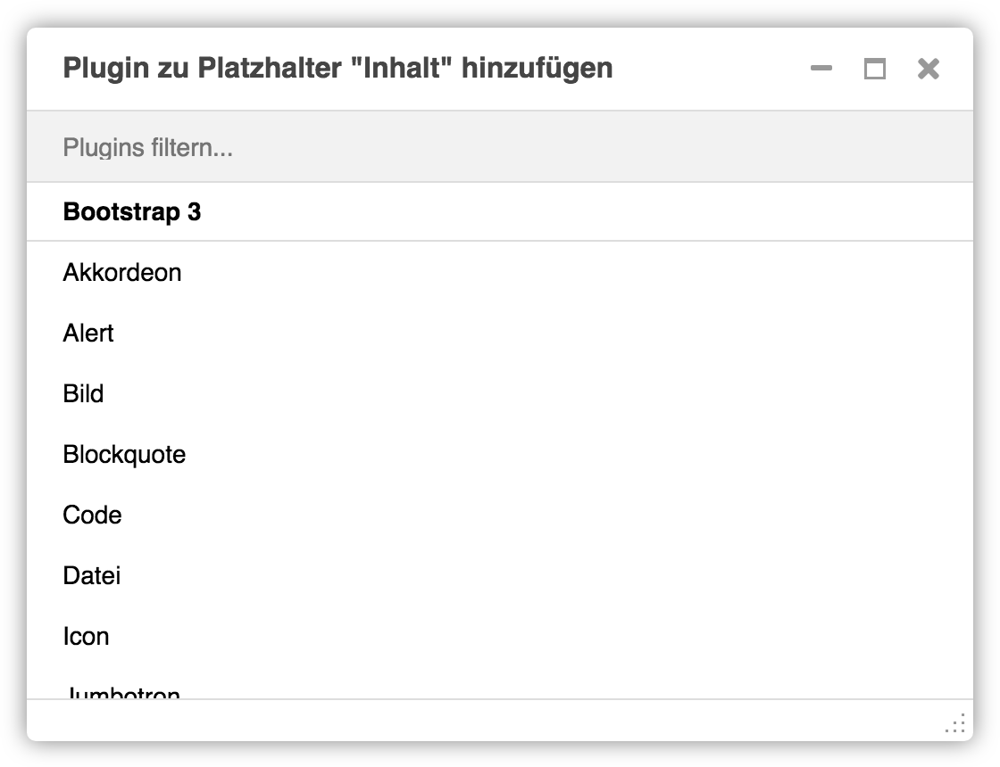

<a name="7-5-teaser">7.5 Teaser</a>
---------

Ein Teaser kann wie folgt hinzugefügt werden:

  1. Unter **Plugin zu Inhalt hinzufügen** nach **Teaser** suchen.
      
      

  2. Im Feld **Limit** die maximale Anzahl an untergeordneten Plugins festgelegen oder leer lassen wenn es keine Beschränkung geben soll.
      
      

  3. Im Feld **Stil** die gewünschte Darstellung der Teaser festlegen.
  4. Übergeordnetes Teaser Plugin mit **Sichern** speichern.
    
      

  5. Mit **Plugin hinzufügen** pro Teaser ein untergeordnetes Plugin einfügen.
      
      

  6. Unter **Seite** die gewünschte Zielseite auswählen.
    
      
      
  7. Bild, Schlagwort und Titel werden automatisch von der Zielseite zugeordnet, sofern diese korrekt hinterlegt sind. Alternativ können Bild, Schlagwort und Titel auch in den Feldern **Bild, Externes Bild, Schlagwort** und **Titel** überschrieben werden.
  8. Im Feld **Veröffentlichen am** kann festgelegt werden, wann der Teaser veröffentlicht werden soll (z.B. 27.03.2018 15:12:52). Ist das Feld leer, wird der Teaser sofort veröffentlicht.
  9. Im Feld **Veröffentlichen bis** kann festgelegt werden, bis wann der Teaser veröffentlicht werden soll (z.B. 27.03.2018 15:12:52). Ist das Feld leer, wird der Teaser nicht automatisch deaktiviert.
  10. Untergeordnetes Seite Plugin mit **Sichern** speichern.
    
      

  11. Das Resultat sollte wie folgt aussehen.
      
      
