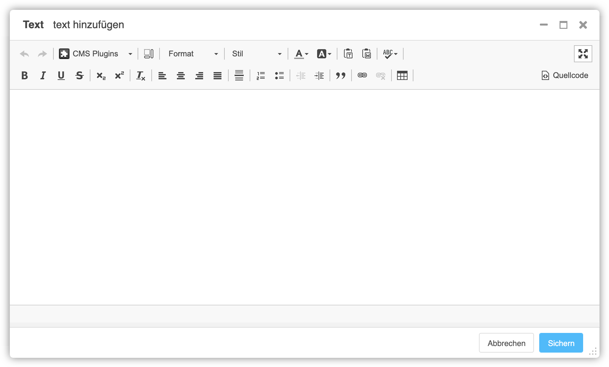

<a name="7-1-text">7.1 Text</a>
--------
Ein Text kann wie folgt hinzugefügt werden:

  1. Unter **Plugin zu Inhalt hinzufügen** nach **Text** suchen.
    
      
      
  2. In der freien Fläche den Text eintragen und wie gewünscht formatieren.
    
      
    
  3. Text Plugin mit **Sichern** speichern.
    
      
    
Beim Text Plugin ist es nicht nötig pro Absatz ein Plugin einzufügen. Texte können innerhalb eines Text Plugins beliebig formatiert werden.
