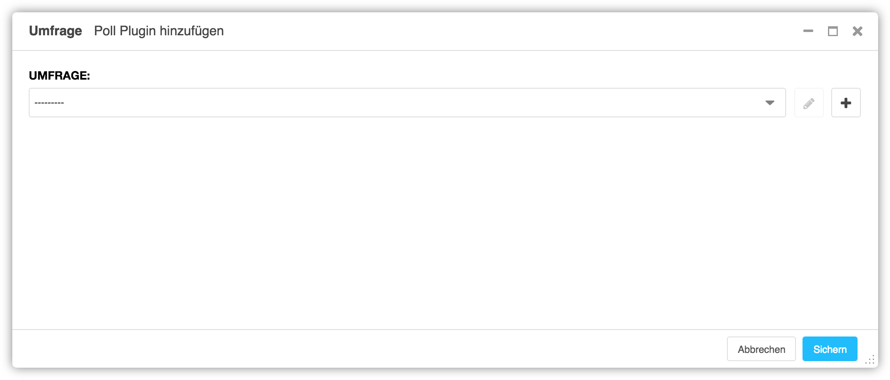
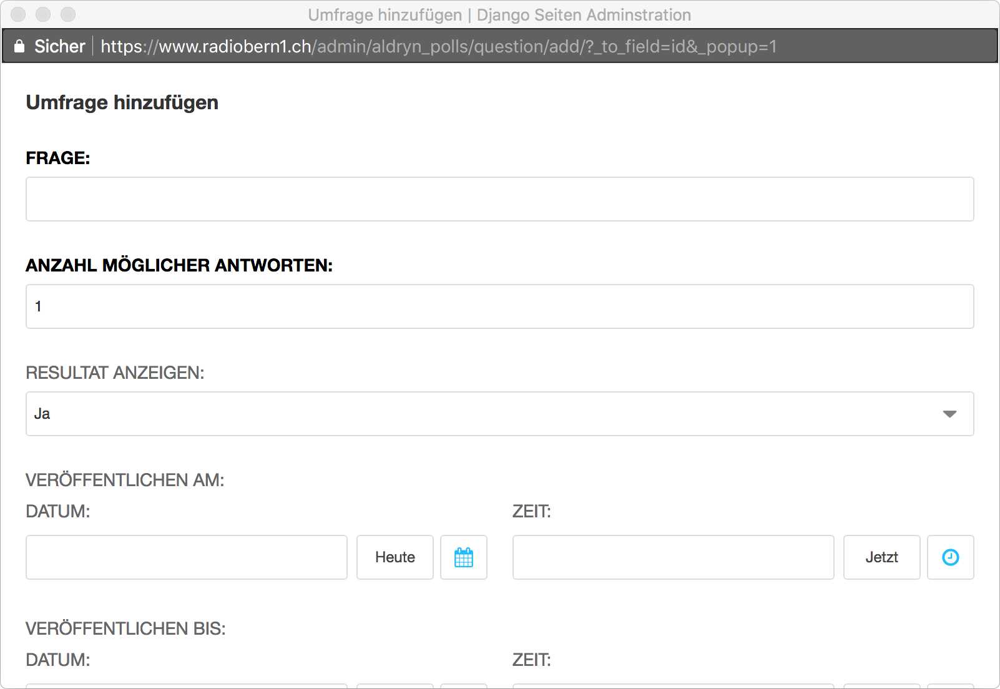
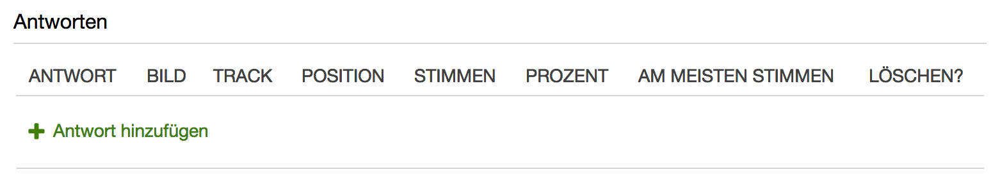

<a name="7-6-umfrage">7.6 Umfrage</a>
----
Eine Umfrage kann wie folgt hinzugefügt werden:

  1. Unter **Plugin zu Inhalt hinzufügen** nach **Umfrage** suchen.
      
      

  2. Unter **Umfrage** eine bestehende Umfrage auswählen, mit **Ausgewählte Umfrage ändern** eine **Umfrage bearbeiten** oder mit Umfrage hinzufügen eine neue Umfrage erstellen.
      
      

  3. Im Fenster **Umfrage hinzufügen** im Feld **Frage** einen Titel oder eine Frage eingeben.
    
      

  4. Unter **Anzahl möglicher Antworten** angeben, wie viele Stimmen pro Person abgegeben werden können.
  5. Unter **Resultat anzeigen** kann festgelegt werden, ob Teilnehmer nach der Stimmabgabe das Resultat sehen können.
  6. Im Feld **Veröffentlichen am** kann festgelegt werden, wann die Umfrage veröffentlicht werden soll (z.B. 27.03.2018 15:12:52). Ist das Feld leer, wird die Umfrage sofort veröffentlicht.
  7. Im Feld **Veröffentlichen bis** kann festgelegt werden, bis wann die Umfrage veröffentlicht werden soll (z.B. 27.03.2018 15:12:52). Ist das Feld leer, wird die Umfrage nicht automatisch deaktiviert.
      
      
  
  8. Unter **Antworten** pro gewünschte Antwort einmal auf **Antwort hinzufügen** klicken.
  9. Antwort hinzufügen.
    a. Feld **Antwort** ausfüllen um eine reine Text Umfrage zu erstellen.
    b. Felder **Antwort** und **Bild** ausfüllen um eine Umfrage mit Text und Bild zu erstellen.
    c. Im Feld **Track** nach einem Song suchen um eine Song Umfrage zu erstellen.
    d. Im Feld **Position** kann die Reihenfolge der Antworten festgelegt werden.
  10. Mit **Sichern** die neu erstellte Umfrage dem Umfrage Plugin hinzufügen.
  11. Umfrage Plugin mit **Sichern** speichern.
      
      
