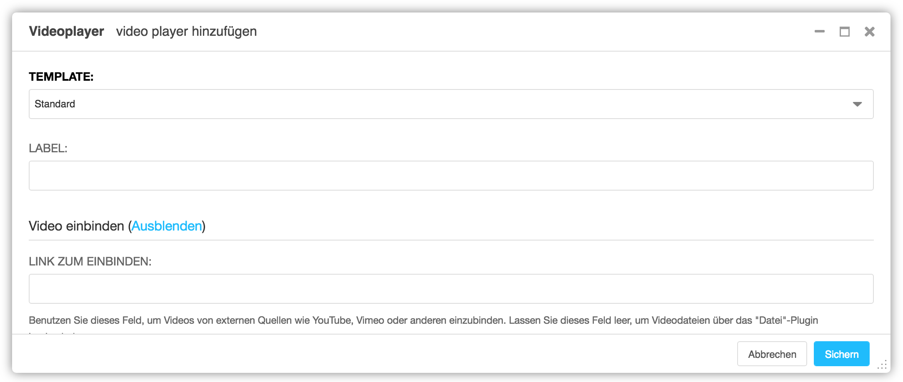

<a name="7-7-videoplayer">7.7 Videoplayer</a>
-----
Es können ausschliesslich YouTube Videos mit dem Videoplayer eingebunden werden. Ein YouTube Video kann wie folgt hinzugefügt werden:

  1. Unter **Plugin zu Inhalt hinzufügen** nach **Videoplayer** suchen.
      
      
    
  2. Unter **Video einbinden** auf **Einblenden** klicken und den YouTube Link unter **Link zum Einbinden** einfügen.
    
      
  3. Video mit **Sichern** speichern.
      
      
