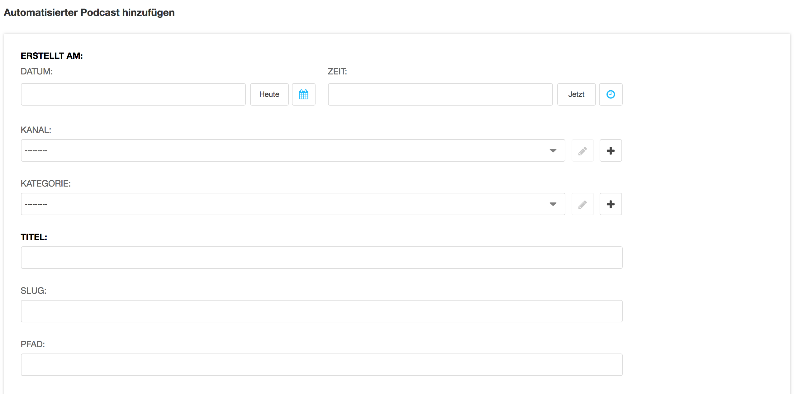

    
<a name="8-2-automatisierter-podcast-hinzufügen">8.2 Automatisierter Podcast hinzufügen</a>
------
Ein Automatischer Podcast kann wie folgt hinzugefügt werden:

  1. In der [django CMS Toolbar](../grundlagen.md#1-1-django-cms-toolbar) unter **Radio Bern1** oder **Radio Zürisee** auf Administration klicken.
  2. Unter **Aldryn Podcasts** auf **Automatisierte Podcasts** und **Automatisierter Podcast hinzufügen** klicken.
    
      

  3. Unter **Erstellt am** das Erstellungsdatum für den Podcast auswählen. Der Automatisierte Podcast wird auf der Webseite beim ausgewählten Datum aufgelistet.
    
      
    
  4. Unter **Kanal** den Standardkanal auswählen und unter **Kategorie** die gewünschte Kategorie auswählen oder eröffnen. Die Felder **Slug** und **Pfad** sollten leer bleiben.
  5. Unter **MP3-Datei** mit einem Klick auf **Datei auswählen** eine MP3-Datei aus der **Medienbibliothek** auswählen.
  6. Mit einem Klick auf **Diese Datei auswählen** die Datei dem Podcast zuordnen.
    
      
      
  7. Unter **Dauer in Sekunden** die Wiedergabedauer des Podcasts in Sekunden eintragen.
  8. Automatisierter Podcast mit **Sichern** speichern.   
    
      
