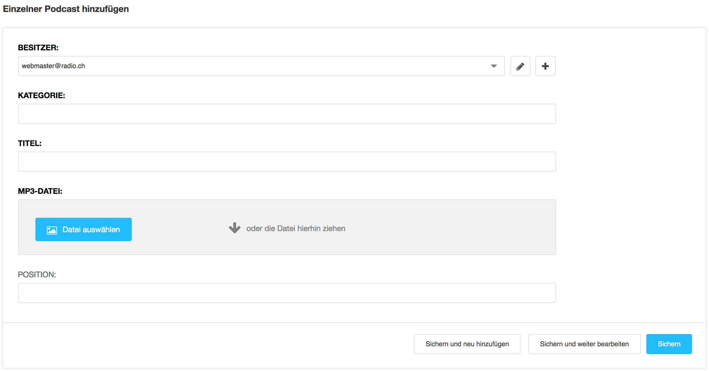

<a name="8-1-einzelner-podcast-hinzufügen">8.1 Einzelner Podcast hinzufügen</a>
------
Ein Einzelner Podcast kann wie folgt hinzugefügt werden:

  1. In der [django CMS Toolbar](../grundlagen.md#1-1-django-cms-toolbar) unter **Radio Bern1** oder **Radio Zürisee** auf **Administration** klicken.
  2. Unter **Aldryn Podcasts** auf **Einzelne Podcasts** und **Einzelner Podcast hinzufügen** klicken.
      
      

  3. Unter **Kategorie** und **Titel** die Kategorie und der Titel des Podcasts eintragen.
  4. Unter **MP3-Datei** mit einem Klick auf **Datei auswählen** eine MP3-Datei aus der **Medienbibliothek** auswählen.
      
      

  5. Mit einem Klick auf **Diese Datei auswählen** die Datei dem Podcast zuordnen.
    
      
      
  6. Unter **Position** kann die Reihenfolge der Darstellung bei der Wiedergabe festgelegt werden.
  7. Einzelner Podcast mit **Sichern** speichern.
    
      
