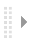
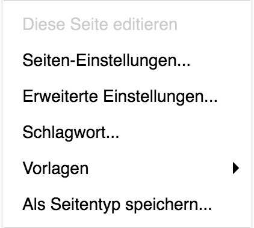
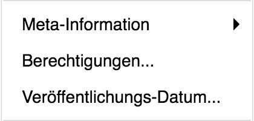
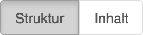
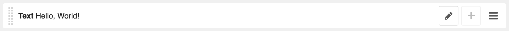
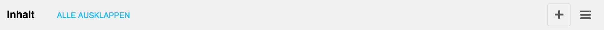
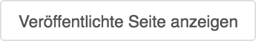

<a name="6-seiten">6 Seiten</a>
==========
Im [Seitenbaum](./grundlagen.md#1-5-seitenbaum) können Seiten unter anderem erstellt, sortiert, versteckt und gelöscht werden:

<a name="6-1-neue-unterseite">6.1 Neue Unterseite</a>
----------
Eine neue Seite kann wie folgt erstellt werden:  
  
  9. In der [django CMS Toolbar](./grundlagen.md#1-1-django-cms-toolbar) **Radio Bern1** oder **Radio Zürisee** auf Seiten klicken. Dies öffnet den **Seitenbaum**.
  10. Unter **Hauptnavigation** zu der Position navigieren, an welcher die neue Seite entstehen soll. Übergeordnete Seiten können mit einem Klick auf das Dreieck entfaltet werden.       
    
      

  11. Mit einem Klick auf **Neue Unterseite** wird der gewünschten übergeordneten Seite eine neue Unterseite zugeordnet.     
      
      
      
  12. In den Feldern **Titel** und **Slug** können Titel und [Slug](./grundlagen.md#1-6-slug) der Seite eingetragen werden. Ist ein Titel für die Darstellung im Menü zu lange, kann dieser im Feld **Menütitel** für die Darstellung im Menü überschrieben werden.
  13. Mit einem Klick auf **Sichern** wird die Unterseite gespeichert. Der Benutzer wird automatisch auf die neue Unterseite weitergeleitet.  
      
      

<a name="6-2-seite-kopieren">6.2 Seite kopieren</a>
-----------
Anstatt eine neue Unterseite zu erstellen, kann eine bestehende Seite auch kopiert werden:

  1. In der [django CMS Toolbar](./grundlagen.md#1-1-django-cms-toolbar) unter **Radio Bern1** oder **Radio Zürisee** auf Seiten klicken. Dies öffnet den **Seitenbaum**.
  2. Unter **Hauptnavigation** die zu kopierende Seite aufrufen.
  3. Mit einem Klick auf **Aktion** und **Kopieren** wird die komplette Seite in die Zwischenablage kopiert.
      
      

  4. Unter **Hauptnavigation** zu der Position navigieren, an der die Kopie der Seite eingefügt werden soll.
  5. Mit einem Klick auf **Aktion** und **Einfügen** wird die kopierte Seite als eine untergeordnete Seite eingefügt.
      
      

<a name="6-3-seiten-einstellungen-ändern">6.3 Seiten-Einstellungen ändern</a>
-----------
Titel und Slug können wie folgt geändert werden:
  
  1. Die gewünschte Seite über das Menü der Webseite oder den [Seitenbaum](./grundlagen.md#1-5-seitenbaum) aufrufen.      
  2. In der [django CMS Toolbar](./grundlagen.md#1-1-django-cms-toolbar) unter **Seite** auf **Seiten-Einstellungen** klicken.      
    
      

  3. In den Feldern **Titel** und **Slug** können Titel und Slug der Seite geändert werden.
  4. Neuer Titel und Slug mit **Sichern** speichern.
      
      

<a name="6-4-erweiterte-einstellungen-ändern">6.4 Erweiterte Einstellungen ändern</a>
-----
Eine automatisch generierte Adresse kann wie folgt überschreiben werden:

  1. Die gewünschte Seite über das Menü der Webseite oder den [Seitenbaum](./grundlagen.md#1-5-seitenbaum) aufrufen.
  2. In der [django CMS Toolbar](./grundlagen.md#1-1-django-cms-toolbar) unter **Seite** auf **Erweiterte Einstellungen** klicken.
      
      
  
  3. Im Feld **Manuelle URL** die gewünschte Adresse ohne Domain eintragen.  
  4. Die manuelle URL mit **Sichern** speichern.
      
      

Eine Umleitung auf eine andere Webseite kann wie folgt erstellt werden:
  
  1. Die gewünschte Seite über das Menü der Webseite oder den [Seitenbaum](./grundlagen.md#1-5-seitenbaum) aufrufen.
  2. In der [django CMS Toolbar](./grundlagen.md#1-1-django-cms-toolbar) unter **Seite** auf **Erweiterte Einstellungen** klicken.
  3. Im Feld **Umleiten** die Zielseite für die Umleitung auswählen oder eine benutzerdefinierte Adresse eintragen.
  4. Umleitung mit **Sichern** speichern.
      
      

<a name="6-5-schlagwort">6.5 Schlagwort</a>
-----
Ein Schlagwort kann wie folgt hinzugefügt werden:

  1. Die gewünschte Seite über das Menü der Webseite oder den [Seitenbaum](./grundlagen.md#1-5-seitenbaum) aufrufen.
  2. In der [django CMS Toolbar](./grundlagen.md#1-1-django-cms-toolbar) unter **Seite** auf **Erweiterte Einstellungen** klicken.
      
      
  
  3. Im Feld **Schlagwort** das Schlagwort eintragen.
  4. **Schlagwort** mit **Sichern** speichern.
      
      

<a name="6-6-meta-informationen">6.6 Meta-Informationen</a>
----------
Meta-Informationen können wie folgt hinterlegt werden:

  1. Die gewünschte Seite über das Menü der Webseite oder den [Seitenbaum](./grundlagen.md#1-5-seitenbaum) aufrufen.
  2. In der [django CMS Toolbar](./grundlagen.md#1-1-django-cms-toolbar) unter **Seite** auf **Meta-Informationen** und anschliessend auf **Deutsch** klicken.
      
      

  3. Im Feld **Bild** kann ein Bild zur Repräsentation der Seite hinzugefügt werden.
  4. Im Feld **Beschreibung** eine Zusammenfassung des Inhalts eintragen.
  5. Meta-Informationen mit **Sichern** speichern.
      
      

<a name="6-7-veröffentlichungs-datum">6.7 Veröffentlichungs-Datum</a>
-----
Soll die Seite zu einem bestimmten Zeitpunkt veröffentlicht oder die Veröffentlichung rückgängig gemacht werden, kann dies über das Veröffentlichungs-Datum wie folgt eingestellt werden:
  
  1. Die gewünschte Seite über das Menü der Webseite oder den [Seitenbaum](./grundlagen.md#1-5-seitenbaum) aufrufen.
  2. In der [django CMS Toolbar](./grundlagen.md#1-1-django-cms-toolbar) unter **Seite** auf **Veröffentlichungs-Datum** klicken.
    
      

  3. Im Feld **Veröffentlicht am** kann festgelegt werden, wann die Seite veröffentlicht werden soll (z.B. 27.03.2018 15:12:52). Ist das Feld leer, wird die Webseite sofort veröffentlicht.
  4. Im Feld **Veröffentlicht bis** kann festgelegt werden, bis wann die Seite veröffentlicht werden soll (z.B. 27.03.2018 15:12:52). Ist das Feld leer, wird die Seite nicht automatisch deaktiviert.
  5. Veröffentlichungsdaten mit **Sichern** speichern.
    
      

<a name="6-8-inhalte">6.8 Inhalte</a>
-----
[Inhalte](./grundlagen.md#1-9-inhalte) können mit einem Plugin wir folgt zu einer Seite hinzugefügt werden:
              
  1. Die gewünschte Seite über das Menü der Webseite oder den [Seitenbaum](./grundlagen.md#1-5-seitenbaum) aufrufen.
  2. In der [django CMS Toolbar](./grundlagen.md#1-1-django-cms-toolbar) in den **Strukturmodus** wechseln.
    
      
      
  3. Beim gewünschten Platz auf **Plugin hinzufügen** klicken.
    
      
            
  4. Unter **Plugin zu Inhalt hinzufügen** das gewünschte Plugin auswählen oder nach dem gewünschten Plugin suchen.
      
      
      
  5. Plugin Inhalte ergänzen und das Plugin mit **Sichern** speichern.
  6. Nachdem die Seite neu geladen wurde, wird das Plugin im Strukturmodus angezeigt. Sind mehrere Plugins einer Seite zugeordnet, können diese mittels Drag and Drop-Funktion (Ziehen und Ablegen) sortiert werden.
      
      

Untergeordnete Plugins können wie folgt hinzufügen:

  1. In der [django CMS Toolbar](./grundlagen.md#1-1-django-cms-toolbar) in den **Strukturmodus** wechseln.
  2. Übergeordnetes Plugin im **Strukturmodus** aufrufen.
  3. Ein untergeordnetes Plugin kann über **Plugin hinzufügen** des entsprechenden übergeordneten Plugins hinzugefügt werden.
      
      

Plugins können wir folgt kopiert und einfügt werden:  

  1. In der [django CMS Toolbar](./grundlagen.md#1-1-django-cms-toolbar) in den **Strukturmodus** wechseln.
  2. Beim zu kopierenden Plugin auf **Aktion** und **Kopieren** klicken.
      
      
      
  3. Beim gewünschten Platz auf **Aktion Symbol** und **Einfügen** klicken um das zuvor kopierte Plugin einzufügen.
      
      

Zwischen dem Entwurf und der Live Version kann wie folgt gewechselt werden:
  
  1. Die gewünschte Seite über das Menü der Webseite oder den [Seitenbaum](./grundlagen.md#1-5-seitenbaum) aufrufen.       
  2. In der [django CMS Toolbar](./grundlagen.md#1-1-django-cms-toolbar) auf **Veröffentlichte Seite anzeigen** klicken um die öffentlich zugängliche Seite anzuzeigen.
      
      
      
  3. In der [django CMS Toolbar](./grundlagen.md#1-1-django-cms-toolbar) auf **Seite bearbeiten** klicken um den Entwurf der Seite anzuzeigen.
      
      

<a name="6-9-im-menu">6.9 Im Menu</a>
--------------
Soll eine Webseite nicht im Menü und im Suchresultat erscheinen, kann diese wie folgt versteckt werden (die Webseite bleibt dabei öffentlich zugänglich):

  1. In der [django CMS Toolbar](./grundlagen.md#1-1-django-cms-toolbar) unter **Radio Bern1** oder **Radio Zürisee** auf Seiten klicken. Dies öffnet den **Seitenbaum**.
  2. In der Hauptnavigation zur gewünschten Seite navigieren und auf das **Im Menu Symbol** klicken.
      
      
      
  3. Wird eine Seite nicht mehr im Menu dargestellt, wird das **Nicht im Menu Symbo**l dargestellt.
    
      

<a name="6-10-seitenänderungen-veröffentlichen">6.10 Seitenänderungen veröffentlichen</a>
-----------

Eine Seitenänderung kann wie folgt veröffentlicht werden:
  
  1. Die gewünschte Seite über das Menü der Webseite oder den [Seitenbaum](./grundlagen.md#1-5-seitenbaum) aufrufen.
  2. In der [django CMS Toolbar](./grundlagen.md#1-1-django-cms-toolbar) auf **Seitenänderungen veröffentliche**n klicken.
    
      

  3. Die zuvor vorgenommenen Änderungen sind ab sofort öffentlich verfügbar.

Seitenänderungen können wie folgt über den Seitenbaum veröffentlicht werden:

  1. In der [django CMS Toolbar](./grundlagen.md#1-1-django-cms-toolbar) unter **Radio Bern1** oder **Radio Zürisee** auf **Seiten** klicken. Dies öffnet den **Seitenbaum**.
  2. In der Hauptnavigation zur gewünschten Webseite navigieren und auf den **blauen Punkt** klicken.
    
      
      
  3. Seiten die noch gar nicht veröffentlicht wurden werden mit einem **grauen Punkt** dargestellt.
    
      
      
  4. Im Auswahlmenu auf **Veröffentlichen** klicken.
  5. Nach der Veröffentlichung wird die Seite mit einem **grünen Punkt** gekennzeichnet. Eine Veröffentlichung kann wie folgt aufgehoben werden:
    
      

Eine Veröffentlichung kann wie folgt aufgehoben werden:           

  1. In der [django CMS Toolbar](./grundlagen.md#1-1-django-cms-toolbar) unter **Radio Bern1** oder **Radio Zürisee** auf **Seiten klicken**. Dies öffnet den **Seitenbaum**.
  2. In der Hauptnavigation zur gewünschten Seite navigieren und auf den **grünen** oder **blauen Punkt** klicken.
    
      

  3. Im Auswahlmenu auf **Veröffentlichung aufheben** klicken.
  4. Nach der Rücknahme der Veröffentlichung wird die Seite mit einem **grauen Punkt** gekennzeichnet.
    
      
