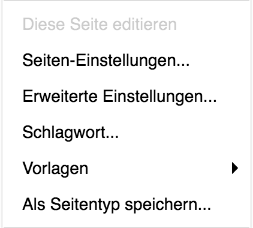

<a name="6-4-erweiterte-einstellungen-ändern">6.4 Erweiterte Einstellungen ändern</a>
-----
Eine automatisch generierte Adresse kann wie folgt überschreiben werden:

  1. Die gewünschte Seite über das Menü der Webseite oder den [Seitenbaum](../grundlagen.md#1-5-seitenbaum) aufrufen.
  2. In der [django CMS Toolbar](../grundlagen.md#1-1-django-cms-toolbar) unter **Seite** auf **Erweiterte Einstellungen** klicken.
      
      
  
  3. Im Feld **Manuelle URL** die gewünschte Adresse ohne Domain eintragen.  
  4. Die manuelle URL mit **Sichern** speichern.
      
      

Eine Umleitung auf eine andere Webseite kann wie folgt erstellt werden:
  
  1. Die gewünschte Seite über das Menü der Webseite oder den [Seitenbaum](../grundlagen.md#1-5-seitenbaum) aufrufen.
  2. In der [django CMS Toolbar](../grundlagen.md#1-1-django-cms-toolbar) unter **Seite** auf **Erweiterte Einstellungen** klicken.
  3. Im Feld **Umleiten** die Zielseite für die Umleitung auswählen oder eine benutzerdefinierte Adresse eintragen.
  4. Umleitung mit **Sichern** speichern.
      
      
