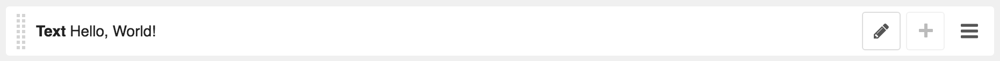
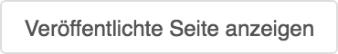

<a name="6-8-inhalte">6.8 Inhalte</a>
-----
[Inhalte](../grundlagen.md#1-9-inhalte) können mit einem Plugin wir folgt zu einer Seite hinzugefügt werden:
              
  1. Die gewünschte Seite über das Menü der Webseite oder den [Seitenbaum](../grundlagen.md#1-5-seitenbaum) aufrufen.
  2. In der [django CMS Toolbar](../grundlagen.md#1-1-django-cms-toolbar) in den **Strukturmodus** wechseln.
    
      
      
  3. Beim gewünschten Platz auf **Plugin hinzufügen** klicken.
    
      
            
  4. Unter **Plugin zu Inhalt hinzufügen** das gewünschte Plugin auswählen oder nach dem gewünschten Plugin suchen.
      
      
      
  5. Plugin Inhalte ergänzen und das Plugin mit **Sichern** speichern.
  6. Nachdem die Seite neu geladen wurde, wird das Plugin im Strukturmodus angezeigt. Sind mehrere Plugins einer Seite zugeordnet, können diese mittels Drag and Drop-Funktion (Ziehen und Ablegen) sortiert werden.
      
      

Untergeordnete Plugins können wie folgt hinzufügen:

  1. In der [django CMS Toolbar](../grundlagen.md#1-1-django-cms-toolbar) in den **Strukturmodus** wechseln.
  2. Übergeordnetes Plugin im **Strukturmodus** aufrufen.
  3. Ein untergeordnetes Plugin kann über **Plugin hinzufügen** des entsprechenden übergeordneten Plugins hinzugefügt werden.
      
      

Plugins können wir folgt kopiert und einfügt werden:  

  1. In der [django CMS Toolbar](../grundlagen.md#1-1-django-cms-toolbar) in den **Strukturmodus** wechseln.
  2. Beim zu kopierenden Plugin auf **Aktion** und **Kopieren** klicken.
      
      
      
  3. Beim gewünschten Platz auf **Aktion Symbol** und **Einfügen** klicken um das zuvor kopierte Plugin einzufügen.
      
      

Zwischen dem Entwurf und der Live Version kann wie folgt gewechselt werden:
  
  1. Die gewünschte Seite über das Menü der Webseite oder den [Seitenbaum](../grundlagen.md#1-5-seitenbaum) aufrufen.       
  2. In der [django CMS Toolbar](../grundlagen.md#1-1-django-cms-toolbar) auf **Veröffentlichte Seite anzeigen** klicken um die öffentlich zugängliche Seite anzuzeigen.
      
      
      
  3. In der [django CMS Toolbar](../grundlagen.md#1-1-django-cms-toolbar) auf **Seite bearbeiten** klicken um den Entwurf der Seite anzuzeigen.
      
      
