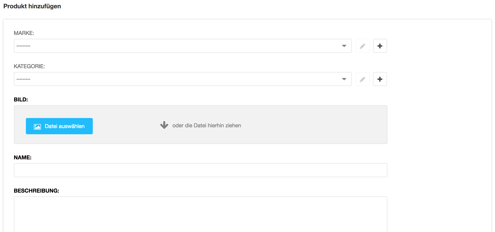
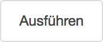

<a name="9-stripe-shop">9 Stripe Shop</a>
======
<a name="9-1-produkt-hinzufügen">9.1 Produkt hinzufügen</a>
------
Ein neues Produkt kann wie folgt hinzugefügt werden:

  1. In der [django CMS Toolbar](./grundlagen.md#1-1-django-cms-toolbar) unter **Radio Bern1** oder **Radio Zürisee** auf **Administration** klicken.
  2. Unter **Aldryn Stripe Shop** auf **Produkte** und **Produkt hinzufügen** klicken.
      
      

  3. Unter **Marke** und **Kategorie** die Marke und Kategorie auswählen oder hinzufügen. Die Felder sind optional.
      
      

  4. In den Feldern **Name** und **Beschreibung** den Namen und die Beschreibung des Produkts hinzufügen.
  5. Die Felder **Preis in Rappe**n (z.B. 1000 für 10 Franken) und **Lager** ergänzen.
  6. Mit **Limit pro Bestellung** kann definiert werden, wievielmal dieses Produkt pro Bestellung gekauft werden kann.
  7. Mit **Limit pro Benutzer** kann definiert werden, wievielmal dieses Produkt insgesamt pro Benutzer gekauft werden kann.
  8. Mit **Ist aktiv** kann ein Produkt manuell aufgeschaltet oder deaktiviert werden und mit **Reihenfolge** wird die Reihenfolge der Darstellung der Produkte im Shop bestimmt.
  9. Für die Versandberechnung die Felder **Versandart**, **Versandkosten in Rappen** (z.B. 500 für 5 Franken), **Einschreiben** (wird das Produkt eingeschrieben versendet) und **Abholung** (kann ein Produkt abgeholt werden) definieren.
  10. Im Feld **Veröffentlichen am** kann festgelegt werden, wann das Produkt veröffentlicht werden soll (z.B. 27.03.2018 15:12:52). Ist das Feld leer, wird das Produkt sofort veröffentlicht.
  11. Im Feld **Veröffentlichen bis** kann festgelegt werden, bis wann das Produkt veröffentlicht werden soll (z.B. 27.03.2018 15:12:52). Ist das Feld leer, wird das Produkt nicht automatisch deaktiviert.
  12. Pro Produkt Variation einmal auf **Variation hinzufügen** klicken und **Name** der Variation eintragen.
      
      

  13. Produkt mit **Sichern** speichern.
      
      

<a name="9-2-bestätigungs-emails">9.2 Bestätigungs-E-Mails</a>
------
Eine benutzerdefinierte Bestätigungs-E-Mail kann wie folgt definiert werden:

  1. In der [django CMS Toolbar](./grundlagen.md#1-1-django-cms-toolbar) unter **Radio Bern1** oder **Radio Zürisee** auf Administration klicken.
  2. Unter **Aldryn Stripe Shop** auf **Bestätigungs-E-Mail** und **Bestätiungs-E-Mail hinzufügen** klicken.
      
      
  
  3. Unter **Produkt** das Produkt auswählen, für welches eine benutzerdefinierte Bestätigungs-E- Mail versendet werden soll.
      
      

  4. Unter **Zusätzlicher E-Mail-Inhalt** einen zusätzlichen Text eingeben.
  5. Bestätiungs-E-Mail mit **Sichern** speichern.
    
      

<a name="9-3-auftraege">9.3 Aufträge</a>
---------
Ein Lieferschein kann wie folgt heruntergeladen werden:

  1. In der [django CMS Toolbar](./grundlagen.md#1-1-django-cms-toolbar) unter **Radio Bern1** oder **Radio Zürisee** auf **Administration** klicken.
  2. Unter **Aldryn Stripe Shop** auf **Aufträge** klicken.
  3. Den gewünschten Auftrag mit einem Häkchen markieren. Es kann nur ein Auftrag ausgewählt werden.
      
      

  4. Im Aktion Auswahlfeld neben dem Suchfeld **Lieferschein herunterladen** auswählen und auf **Ausführen** klicken.     
    
      

Aufträge können wie folgt statistisch ausgewertet werden:

  1. In der [django CMS Toolbar](./grundlagen.md#1-1-django-cms-toolbar) unter **Radio Bern1** oder **Radio Zürisee** auf Administration klicken.
  2. Unter **Aldryn Stripe Shop** auf Aufträge klicken.
  3. Die gewünschten Aufträge mit einem Häkchen markieren.
      
      

  4. Im Aktion Auswahlfeld neben dem Suchfeld **Bericht erstellen** auswählen und auf **Ausführen** klicken.
    
      

<a name="9-4-aufträge-exportieren">9.4 Aufträge exportieren</a>
------
Aufträge können wie folgt exportiert werden:

  1. In der [django CMS Toolbar](./grundlagen.md#1-1-django-cms-toolbar) unter **Radio Bern1** oder **Radio Zürisee** auf **Administration** klicken.
  2. Unter **Aldryn Stripe Shop** auf **Aufträge** klicken.
  3. Aufträge Nach **Namen** filtern oder **Alle** auswählen um sämtliche Aufträge zu exportieren und auf **Exportieren** klicken.
      
      

  4. Das gewünscht **Dateiformat** auswählen und mit einem Klick auf **Vorlegen** den Download starten.
      
      

<a name="9-5-kunden">9.5 Kunden</a>
-------
Das Profil eines Kunden kann wie folgt angepasst werden:

  1. In der [django CMS Toolbar](./grundlagen.md#1-1-django-cms-toolbar) unter **Radio Bern1** oder **Radio Zürisee** auf **Administration** klicken.
  2. Unter **Aldryn User Profiles** auf **Profile** klicken. 
  3. Nach dem gewünschten Profil suchen und dieses öffnen.
      
      

  4. Mit einem Klick auf **Ausgewählter Benutzer ändern** unter **Benutzer** können **Benutzername, Passwort, Vorname, Nachname** und **E-Mail-Adresse** geändert werden.
    
      
  5. Die Felder **Strasse, Postleitzahl, Ortschaft, Telefonnummer** und **Geburtsdatum** können unter Profil ändern angepasst werden.
  6. Profil mit **Sichern** speichern.        
      
      
