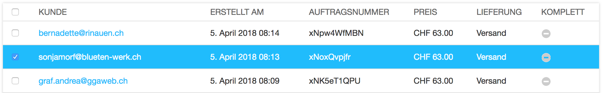

<a name="9-3-auftraege">9.3 Aufträge</a>
---------
Ein Lieferschein kann wie folgt heruntergeladen werden:

  1. In der [django CMS Toolbar](../grundlagen.md#1-1-django-cms-toolbar) unter **Radio Bern1** oder **Radio Zürisee** auf **Administration** klicken.
  2. Unter **Aldryn Stripe Shop** auf **Aufträge** klicken.
  3. Den gewünschten Auftrag mit einem Häkchen markieren. Es kann nur ein Auftrag ausgewählt werden.
      
      

  4. Im Aktion Auswahlfeld neben dem Suchfeld **Lieferschein herunterladen** auswählen und auf **Ausführen** klicken.     
    
      

Aufträge können wie folgt statistisch ausgewertet werden:

  1. In der [django CMS Toolbar](../grundlagen.md#1-1-django-cms-toolbar) unter **Radio Bern1** oder **Radio Zürisee** auf Administration klicken.
  2. Unter **Aldryn Stripe Shop** auf Aufträge klicken.
  3. Die gewünschten Aufträge mit einem Häkchen markieren.
      
      

  4. Im Aktion Auswahlfeld neben dem Suchfeld **Bericht erstellen** auswählen und auf **Ausführen** klicken.
    
      
