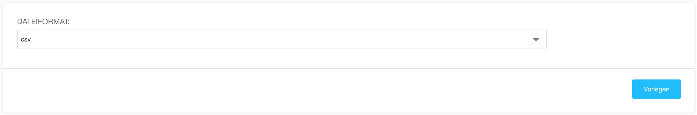

<a name="9-4-aufträge-exportieren">9.4 Aufträge exportieren</a>
------
Aufträge können wie folgt exportiert werden:

  1. In der [django CMS Toolbar](../grundlagen.md#1-1-django-cms-toolbar) unter **Radio Bern1** oder **Radio Zürisee** auf **Administration** klicken.
  2. Unter **Aldryn Stripe Shop** auf **Aufträge** klicken.
  3. Aufträge Nach **Namen** filtern oder **Alle** auswählen um sämtliche Aufträge zu exportieren und auf **Exportieren** klicken.
      
      

  4. Das gewünscht **Dateiformat** auswählen und mit einem Klick auf **Vorlegen** den Download starten.
      
      
