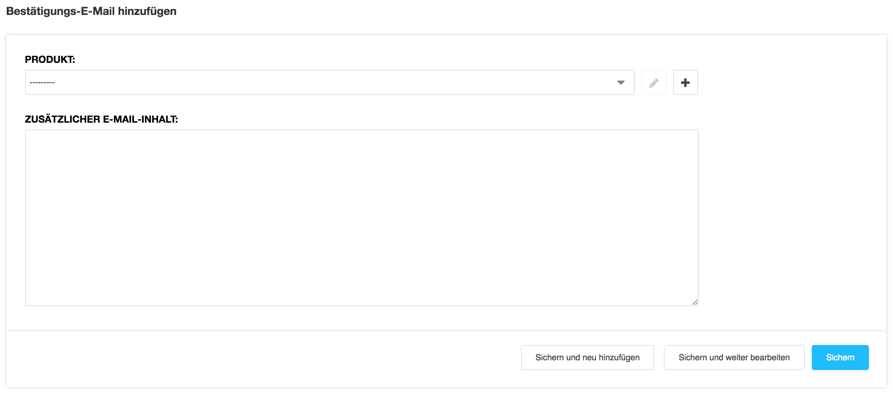

<a name="9-2-bestätigungs-emails">9.2 Bestätigungs-E-Mails</a>
------
Eine benutzerdefinierte Bestätigungs-E-Mail kann wie folgt definiert werden:

  1. In der [django CMS Toolbar](../grundlagen.md#1-1-django-cms-toolbar) unter **Radio Bern1** oder **Radio Zürisee** auf Administration klicken.
  2. Unter **Aldryn Stripe Shop** auf **Bestätigungs-E-Mail** und **Bestätiungs-E-Mail hinzufügen** klicken.
      
      
  
  3. Unter **Produkt** das Produkt auswählen, für welches eine benutzerdefinierte Bestätigungs-E- Mail versendet werden soll.
      
      

  4. Unter **Zusätzlicher E-Mail-Inhalt** einen zusätzlichen Text eingeben.
  5. Bestätiungs-E-Mail mit **Sichern** speichern.
    
      
