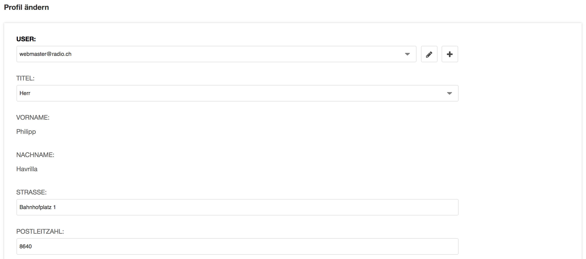

<a name="9-5-kunden">9.5 Kunden</a>
-------
Das Profil eines Kunden kann wie folgt angepasst werden:

  1. In der [django CMS Toolbar](../grundlagen.md#1-1-django-cms-toolbar) unter **Radio Bern1** oder **Radio Zürisee** auf **Administration** klicken.
  2. Unter **Aldryn User Profiles** auf **Profile** klicken. 
  3. Nach dem gewünschten Profil suchen und dieses öffnen.
      
      

  4. Mit einem Klick auf **Ausgewählter Benutzer ändern** unter **Benutzer** können **Benutzername, Passwort, Vorname, Nachname** und **E-Mail-Adresse** geändert werden.
    
      
  5. Die Felder **Strasse, Postleitzahl, Ortschaft, Telefonnummer** und **Geburtsdatum** können unter Profil ändern angepasst werden.
  6. Profil mit **Sichern** speichern.        
      
      
